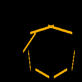
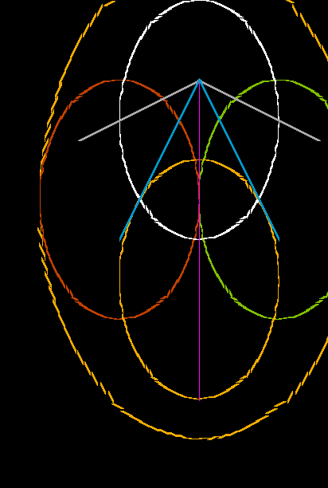
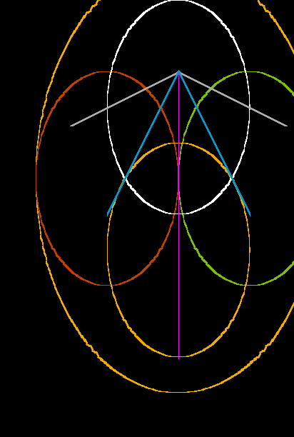
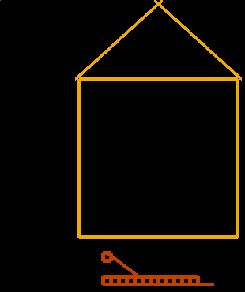
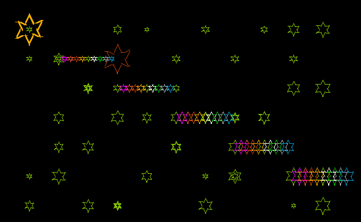
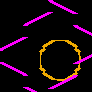
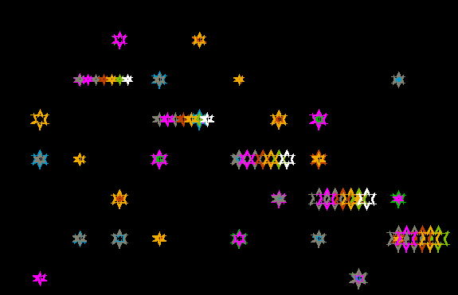
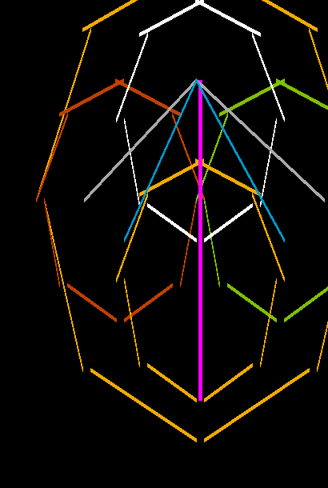
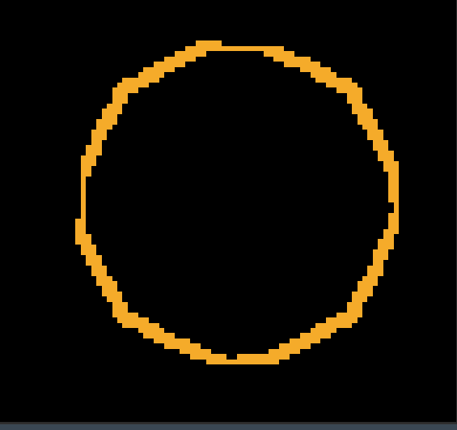
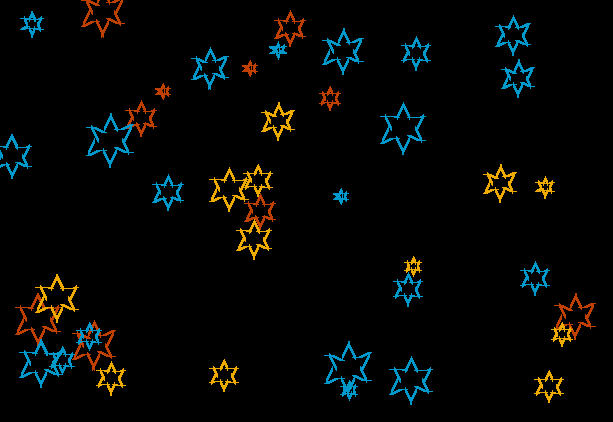

# Homework solutions for BIK-PA2 @ B212 @ [FIT CTU](https://fit.cvut.cz/en)

In this repo, you can find my solutions for [Progtest](https://progtest.fit.cvut.cz) tasks assigned in B202 and B212 (some of them are identical). The repo is published in the hope it might help someone. 

## Quick summary

Even though my results were not 100%, at least I can tell that I tried.  


### Normal tasks: 

- 01: 4.87 points gained / 5 + 0.50 (bonus) total
- 02: 5.00 points gained / 5 + 0.50 (bonus) total
- 03: 4.91 points gained / 5 + 0.50 (bonus) total
- 04: 0.00 points gained / 5 + 0.50 (bonus) total
- 05: 5.50 points gained / 5 + 0.50 (bonus) total
- 06: 3.00 points gained / 5 + 0.50 (bonus) total
- 07: 0.00 points gained / 5 + 0.50 (bonus) total


### Semester task: 

My semester task was [TSpain(t)](semestralProject/README.md). 
Gained 10.7400 / 12.0000 total possible points with following detailed rating: 

```
[20 %] Completion of assignment
90% (Meets assignment)
[20 %] Program function
90 % (Works correctly )
[20%] Module and class division, encapsulation
100 % (Division into modules, classes and methods without reservations)
[5 %] Code readability and clarity, use of appropriate syntactic constructs
70% (Sometimes unclear code, occasional long/overly embedded constructs)
[5%] Code formatting (indentation, choice of identifiers, ...)
70% (Systematic with occasional inconsistencies)
[7%] Comments
50 % (Substantial comments are sometimes missing)
[8 %] Makefile
100 % (Ok, correct dependencies, parameterized, readable)
[5 %] GIT
100% (Regular use)
[10%] Testing
100% (Intensive (test suites, unit tests, ...))
Overall rating: 89.50 %
```

and these amazing drawing results

|                                                                                         |                                                                                         |                                                                                                               |
|-----------------------------------------------------------------------------------------|-----------------------------------------------------------------------------------------|---------------------------------------------------------------------------------------------------------------|
|          |        |  |
|              |  |                      |
|                |  |                          |
|        |              |                                |
|              |            |                                    |
|  |      |                                  |


## Copying

I strongly discourage you from copying the code from the repository. 
If you are looking for inspiration, take a look [here](https://github.com/JahodaPaul/FIT_CTU)). There is nothing really to copy. In case you deside to do so, it might help you at the moment, but in the long-term, it will just harm you. Most of the courses @ [Progtest](https://progtest.fit.cvut.cz) have an anti-cheating mechanism, be aware. It might not be easy, but you are here to acquire knowledge and if you'd wanted it by the easy way, you wouldn't have chosen [FIT CTU](https://fit.cvut.cz/en). 


