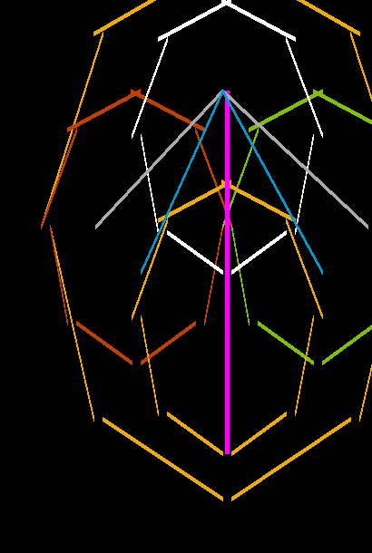
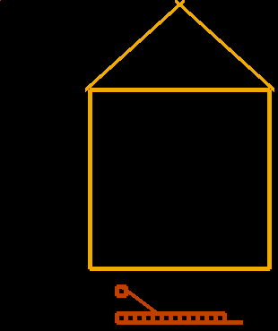
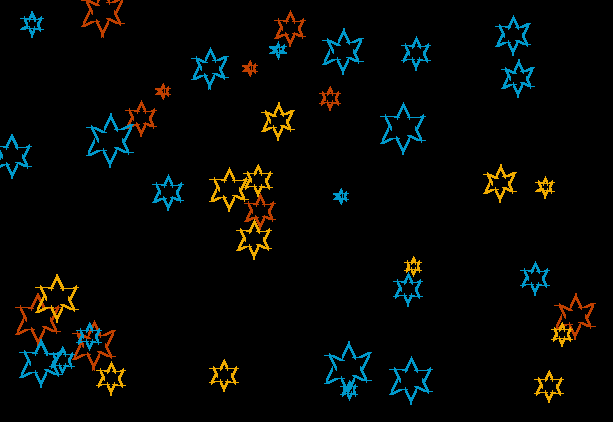
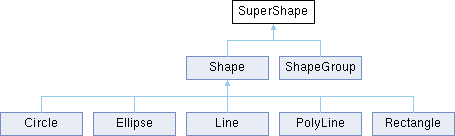
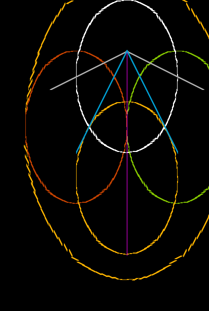
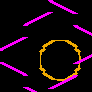
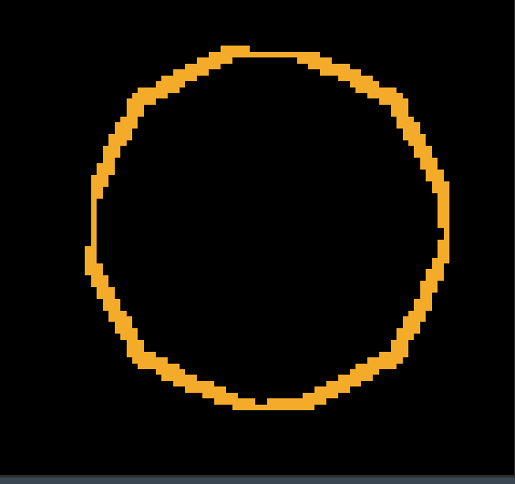

# tspain(t)


|                                                                          |                                                                                     |                                                                           |
|--------------------------------------------------------------------------|-------------------------------------------------------------------------------------|---------------------------------------------------------------------------|
|  |  |  |

## Zadání z progtestu, rok 2022/2023

Tato semestrální práce patří do kategorie konzolových utilit. Vaším cílem je vytvořit nástroj, který uživatel z
terminálu spustí (s různými parametry). Případné parametry nástroje se nesnažte definovat přímo v kódu (a to ani pomocí
konstant). Umístěte je do konfiguračních souborů (jednoho nebo více), které váš program bude načítat.

Vaším cílem je naprogramovat nástroj pro zobrazení obrázků definovaných pomocí konfiguračního souboru. Nástroj na vstupu
dostane definici ve Vámi definovaném textovém formátu a na výstupu bude obrázkový soubor s vykresleným obrázkem podle
specifikace.

Nástroj musí splňovat následující funkcionality:

Nástroj podporuje minimálně následující objekty:

čára, kruh, elipsa, obdélník,

skupina (obsahuje jiné objekty, vč. skupin),

implementujte další 3 vlastní druhy objektů (př. trojúhelník, hvězda, spirála, …).

Objektům se dají nastavovat různé parametry (př. barva, výplň, druh čáry).

Jednotlivé objekty je pak nutné reprezentovat jako tzv. graf scény, tedy stromová struktura (příp. DAG neboli
orientovaný acyklický graf) obsahující jednotlivé objekty (vč. skupin). Skupinu je tak možné použít na více místech bez
nutnosti opakované definice (podobně jako funkce).

Implementujte alespoň 2 různé běžné výstupní formáty (př. ASCII art, BMP, JPEG, SVG, …, SDL, OpenGL, …).

Obrázek je definován prostřednictvím konfiguračního souboru:

velikost obrázku,

definice skupin,

pozice a parametry objektů.

Kde lze využít polymorfismus? (doporučené)

objekty k vykreslení: kruh, trojúhelník, obdélník,…

dekodér vstupních dat: příkazová řádka, (vlastní) textový formát, XML, …

enkodér výstupních dat: ASCII (různé druhy), BMP, JPEG, SVG, …, SDL, OpenGL, (výstup můžete zobrazit přímo na
obrazovku) …

nástroje k vykreslení: stínování, vyplnění objektu barvou, …

Další informace:

https://www.root.cz/clanky/graficky-format-bmp-pouzivany-a-pritom-neoblibeny/

http://www.vzhurudolu.cz/prirucka/svg

http://www.onicos.com/staff/iz/formats/gif.html

Můžete implementovat i sekvenci obrázků (video)

Při implementaci se vyvarujte definováno konstant, které reflektují jednotlivé objekty. Tím se připravujete o
polymorfismus. (Pro vykreslování si definujte jednoduchá primitiva: čára a křivka. Následně ostatní objekty vykreslujte
prostřednictvím těchto primitiv.)

## Zadání z progtestu, rok 2021/2022

Naprogramujte jednoduchý nástroj pro zobrazení obrázků definovaných v textovém souboru.

Program musí splňovat následující funkcionality:

Načíst ze souboru a z konzole definici jednotlivých objektů v prostoru (velikost obrázku, pozice a parametry
objektů, ...).

- Program podporuje minimálně čáru, polyline, kruh, elipsu, obdélník a skupinu objektů.
- Objektům se dají nastavovat různé barvy (v případě ASCII styl vykreslování) a výplně.
- ***Obrázek je nutné reprezentovat jako graf scény - stromovou strukturu (případně DAG)***
- Skupina objektů funguje jako vzor, tudíž po vytvoření skupiny objektů můžu tuto skupinu vložit několikrát do obrázku
  na různá místa.
- Implementujte alespoň 2 různé výstupní formáty (ASCII, BMP, SVG, ..., SDL, OpenGL, ...)

Kde lze využít polymorfismus?

- objekty k vykreslení: kruh, trojúhelník, obdélník,...
- dekodér vstupních dat: příkazová řádka, (vlastní) textový formát, XML, ...
- enkodér výstupních dat: ASCII (různé druhy), BMP, SVG, ..., SDL, OpenGL, (výstup můžete zobrazit přímo na
  obrazovku) ...
- nástroje k vykreslení: stínování, vyplnění objektu barvou, ...

Další informace:

- https://www.root.cz/clanky/graficky-format-bmp-pouzivany-a-pritom-neoblibeny/
- http://www.vzhurudolu.cz/prirucka/svg
- http://www.onicos.com/staff/iz/formats/gif.html

Možno implementovat i sekvenci obrázků (video)

## Assignment from progtest 2021/2022

Program a simple tool to display images defined in a text file.

The program must meet the following functionalities:

Load from the file and from the console the definition of each object in the space (image size, position and parameters
of the objects, ...).

- The program supports at least line, polyline, circle, ellipse, rectangle and group of objects.
- Different colors (in case of ASCII style of rendering) and fills can be set for objects.
- ***The image must be represented as a scene graph - a tree structure (or DAG)***
- A group of objects acts as a pattern, so after creating a group of objects I can insert this group several times in
  the image in different places.
- Implement at least 2 different output formats (ASCII, BMP, SVG, ..., SDL, OpenGL, ...)

Where can I use polymorphism?

- objects to render: circle, triangle, rectangle,...
- input data decoder: command line, (custom) text format, XML, ...
- output data encoder: ASCII (various types), BMP, SVG, ..., SDL, OpenGL, (you can display the output directly on the
  screen) ...
- rendering tools: shading, filling the object with color, ...

Additional information:

- https://www.root.cz/clanky/graficky-format-bmp-pouzivany-a-pritom-neoblibeny/
- http://www.vzhurudolu.cz/prirucka/svg
- http://www.onicos.com/staff/iz/formats/gif.html

Image sequence can be implemented (video)

## Extending the assignment

Almost everyone remembers the "good old" painting, MSPAINT. It covers minimal requirements
from [progtest assignment](#assignment-from-progtest)
and adds some nice features like thematic Progtest (TM) Color pallet, randomly occurring error messages, and more.

This "extension" of the popular program targets BI-PA2 students who have still in a vivid memory those beautiful
moments spent by debugging code that for some reason crashes, and they have no idea why.
From the popular Progtest environment, the program tspain(t) takes only the best - strict user input, which,
if it does not match the specification, leads to program termination.
Among other things, it offers only a limited number of colors, which students, aptly named after their favorite program
on
Sunday afternoons, by listing

- Progtest grey `GRAY__PROGTEST` (`#aaaaaa`)
- Where the eye cannot see `GRAY__OUT_OF_SIGHT` (`#828272`)
- In the depths of the soul `BLACK__INSIDE_OF_MY_SOUL` (`#000000`)
- Brain overflow - `MAGENTA__BRAIN_OVERFLOW` color test (`#ff00ff`)
- At home - standard progtest color `GREEN__PROGTEST_HOME` (`#00ff00`)
- Compiled with errors `RED__COMPILED_WITH_ERRORS` (`#c04000`)
- Fun for the Weekend - task assignment color `BLUE__FUN_FOR_A_WEEKEND` (`#0099cb`)
- Green "We're almost there" `GREEN__ALMOST_THERE` (`#80c000`)
- Green Victory `GREEN__IM_DONE` (`#00c000`)
- Loading - white `WHITE__LOADING` (`#ffffff`)
- FIT yellow `YELLOW__FIT` (`#f0ab00`)
- Orange pain `ORANGE__PAIN` (`#ff5733`)

But where would we be if there wasn't some all-encompassing and at the same time absolutely unspoken error message,
or their combination? At random moments, the user is delighted with the old familiar message
`"The program performed an invalid operation and was terminated (Segmentation fault/Bus error/Memory limit exceeded/Stack limit exceeded)"`,
or it's variation.

The program has a minimalist CLI user interface that allows everything a PA2 student could wish for - a strict
user interface that has nothing extra. As an act of kindness the program offers help command and asks the user several
times for correction in case the input is incorrect.
The program allows export to a format in which even users with less imagination will be able to view it
outside tspain(t), where it won't be such a pain.

### Polymorphism

- objects to draw: circle, ellipse, rectangle, polyline, group of objects, line
- output data encoder: BMP, SVG, tspaint

There are several usages of Polymorphism.

- First usage is the `PolyLine` class, which is used for exporting `Shape`-based objects.
- Second usage is Export class it's `Process` method, which is used for exporting `ShapeGroup`- based objects for
  specific formats, where each exporter has its own implementation for that method, but unified interface. Same goes
  with `Start` and `End` methods.
- Third is the `Draw` class which allows any child of `SuperShape` to be exported. The implementation for that method
  differs for `ShapeGroup` and `Shape`.

#### Why nd how PolyLine is used

Polymorphism is used for rendering and exporting objects. Across the code we can see a `Draw` method.
This is used to prepare objects for export. All objects inheriting from `Shape` can actually be rendered
using `PolyLine`,
so the conversion to `PolyLine` is used in the export. The `Draw` method is also used to prepare the ShapeGroup objects
for export,
so any child of `SuperShape` can actually be drawn using the `Draw` method.

The modification with `PolyLine` was based on a previous submit last year, where the `SuperShape`'s `Draw` method was
used to draw any object,
however for every sigle one the implementation differed. Besides, it used shape-specific commands, thus required
exporters
to support multiple shapes which could be substitued with single universal `PolyLine` object.
This comes for a price of unability of usage of more advanced shapes for example in SVG, but makes the code
easier to maintain.
The different exporters only define the minimum number of different objects - Polylines.
Literally any object or group of objects can be converted to PolyLine, but it is sufficient to implement any of the
exporters
actually only one method.

Inheritance is used for some shapes, for example, a square is a special case of a rectangle, and basically they are just
four lines that are given some perpendicularity or parallelism, so they can be rendered with PolyLine.
With a little imagination, this can also be applied to an ellipse, or a circle, which is a special case of an ellipse.

#### Tspaint format

By cleverly designing the interface, one can then use the input and output streams to make the interface work
interactively.
But not only that, it is also possible to use the same interface to work with files, which is a great advantage.
Basically that's the `.tspaint` "format".

### Class diagram of SuperShape and its children



## Tspaint standard

This is a specification for tspaint input/output format. Format is matching interactive command line input, however
for a purpose of this work there needs to be a strict format specified.

Tspaint is a plaintext file with instructions/command calls. Only non-system commands are allowed in this standard,
thus it is not allowed to import file with commands like 'load', 'save', 'quit' etc.

Set command is a modifier, similary to old good mspaint, it changes the color/fill/thickness/..., which is applied to
any shape created since that.

## Results 


|                                                                        |                                                                        |                                                                                              |
|------------------------------------------------------------------------|------------------------------------------------------------------------|----------------------------------------------------------------------------------------------|
|          |        |  |
|              |  |                      |
|                |  |                          |
|        |              |                                |
|              |            |                                    |
|  |      |                                  |


## Commands (interactive mode)

### DRAW Command

Generate shapes/groups based on user input and stores them in the tspaint object. The shape, position, and
other properties can be modified using the "set" command.

#### Syntax

```Syntax: draw {line, polyline, circle, ellipse, star, square, rectangle, triangle, group} <coordinates...>```

#### Usage 

- `draw line <pos_start> <pos_end>`: Draws a line segment.
- `draw polyline <pos_start> [<input_len> <pos_i>...]`: Draws a sequence of connected line segments.
- `draw circle <pos_center> <diameter>`: Draws a circle.
- `draw star <pos_center> <diameter>`: Draws a star.
- `draw ellipse <pos_center> <radius_x>, <radius_y>`: Draws an ellipse.
- `draw rectangle <pos_left_bottom> <pos_right_top>`: Draws a rectangle.
- `draw square <pos_left_bottom> <pos_right_top>`: Draws a square.
- `draw triangle <point1> <point2> <point3>`: Draws a closed connection between three points, which might or might not
  produce a triangle based on user input.
- `draw group <group_id> <pos_left_bottom>`: Draws a group object.

### SET Command

The SET command in the drawing program allows you to modify various attributes such as color, fill, and thickness.

#### Syntax:

```set {color, fill, thickness} <id> | <r> <g> <b>```

#### Usage

- `set color <id>;` or `set color <r> <g> <b>;`: Sets the color of the drawing object.
- `set fill <id>;` or `set fill <r> <g> <b>;`: Sets the fill color of the drawing object.
- `set thickness <int>;`: Sets the thickness of the lines in the drawing.

### Group Commands

Performs operations related to grouping shapes.

#### Syntax

- ```group {objects, clone, list, help}```

#### Usage

- `group objects <id>`: Retrieves a list of objects in the specified group.
- `group clone <id> <new_id>`: Creates a clone of the specified group with a new ID.
- `group list`: Lists all existing groups.
- `group help`: Displays help information for group-related commands.

### Save-Related Commands

- `save {svg, bmp} <file_name>`: Saves the current state of the drawing to a file with the specified name and type.
  Warning, fill isn't supported in BMP and SVG export. Tspaint export isn't supported yet.
- `load <file_name>`: Loads a saved drawing from the specified file. **This is very important as the assignment changed in 2022/2023 and requires a config file.**

### Control Commands

- `list` : Lists all created shapes with their colors, thickness, positions, etc.
- `quit` : Quits the program.
- `help` : Displays help information for all commands.

Recommended separators are whitespaces. It is advised, however not required to write one command per line.
If invalid input is detected (e.g. string where integer is expected), the rest of line is ignored.

## Tspaint in "configuration file" mode

As the assignment in 2022/2023 changed, the program now requires to be albe to be executed from commandline without input
from the user. To achieve that, you avoid entering interactive mode by providing a configuration file. 

```
./dostato6 <examples/skyofstars.tspaint >/dev/null        #2>/dev/null
./dostato6 <source_file.tspaint         ^^^ ignore stdout as it's not relevant
                                                         ^^^ optional (uncomment) ignore stderr (problems with input file)
```

### Configuration file specifications 

Configuration file is a plaintext file with instructions/command calls as described in [Commands - interactive mode](#commands-interactive-mode) section. 
Please keep in mind that in order to save a output you need to specify a `save` command as described in [Save-Related Commands](#save-related-commands) section.


## Possible improvements
Regarding the feedback from submission, there are some possible improvements:
- Better documentation of Interface including what this class do, same with Command
